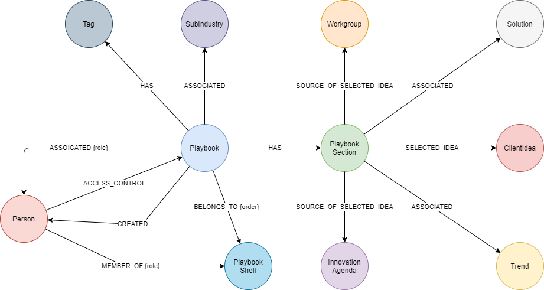

### **Node Definitions**

#### Node Label: Playbook

|Property|Description|type|limits
|----|----|----|----|
|id|system generated
|title |name of the solution|string string |240 Characters
|Subtitle| |string string |240 Characters
|CoverImageURI|URI address for the image
|bannerImageURI|URI address for the image
|bannerTextColour| defines the text colour to be used within the banner|
|MoreInfo| | | Valid URL
|dxcOnly|Controls if the playbook is restricted to DXC users only | Boolean|
|isPrivate|Controls if the playbook is restricted to named contacts only | Boolean| 
|order|Controls the display position within the playbook shelf | |
|creationDate|

#### Node Label: PlaybookSection

|Property|Description|type|limits
|----|----|----|----|
|id|system generated
|layout|Type of page layout| |See below for layout types
|Text|Page Text |string |5000 Characters
|SecondText|Page SubTitle |string |5000 Characters
|ImageURI|URI address for the image

|Layout|Description|
|---|---|
|GRAPH|Graph view from workspace
|T_MAP|TMAP diagram from roadmaps
|SUMMARY|Summary table from roadmaps
|COMPARE|Compare view from workspace
|RISK_TABLE|Risk table from roadmaps
|TWO_COLUMNS_IMAGE_LEFT|1 text column image left
|TWO_COLUMNS_IMAGE_RIGHT|1 text column image left
|THREE_COLUMNS_IMAGE_LEFT|2 text columns image right
|THREE_COLUMNS_IMAGE_RIGHT|2 text columns image right
|THREE_COLUMNS|3 text columns
|TWO_COLUMNS|2 text columns
|ONE_COLUMN|single image view (full page)

#### Node Label: PlaybookShelf

|Property|Description|type|limits
|----|----|----|----|
|id|system generated
|name |

#### Relationships

|Source|Destination|Name|Properties|
|----|----|----|----|
|Playbook|PlaybookSection|HAS
|Playbook|BusinessTrend|ASSOCIATED
|Playbook|TechnologyTrend|ASSOCIATED
|Playbook|Solution|ASSOCIATED
|Playbook|SubIndustry|ASSOCIATED
|Playbook|Tag|HAS
|Playbook|Person|ASSOCIATED
|Playbook|Person|CREATED |creationDate
|Playbook|PlaybookShelf|BELONGS_TO|order
|Person|PlaybookShelf|MEMBER_OF|Role
|Person|Playbook|ACCESS_CONTROL|

## Change log

| Date | By | Description
|---|---|---|
|April 2019| David Stevens | First version
|June 2020| David Stevens | Sort order for playbooks
|July 2020| David Stevens | Access controls for external users
