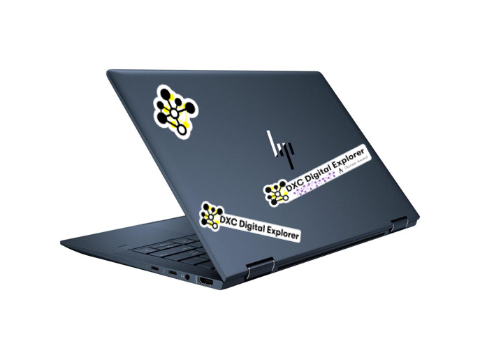
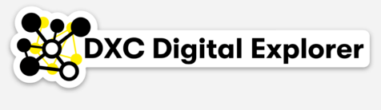

# Digital Explorer laptop stickers
 

## Aim

### Use the physical stickers to drive conversations and awareness with colleagues and customers

## How

Giveaway Digital Explorer laptop stickers to people who:
- Complete the **Pioneer activities** via DXC workplace
- Attend a local meet-up or awareness event
- Support DE ride-alongs in client engagements

## Pioneer Event

Launch and track via DXC Workplace.  awarded to anyone who completed all 3 belts and creates and shared a playbook in Workplace. 

Playbook must contain the following sections
  - Standard Pages
  - Workspace views * 
  - Roadmap views * 
  - Key Trends
  - Showcase Solutions *

_** must include at least 2 of these_

## Meet-ups and awareness session
Logo and Standard stickers available to anyone attending a local meet-up or awareness session

## Ride-alongs
Digital Explorer Champions to partner with pioneering CT’s/DSD’s and support creation of key assets within the platform

## Ordering stickers
Stickers can be ordered via [Sticker Mule](https://www.stickermule.com/uk)

## Initial quantities

- Logo : 200
- Pioneer Event : 50
- Standard : 200

## Designs

### Logo

### Pioneer

### Standard

