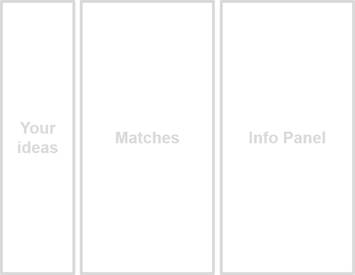
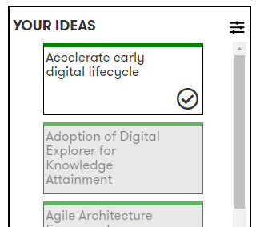
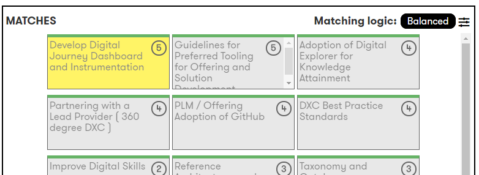
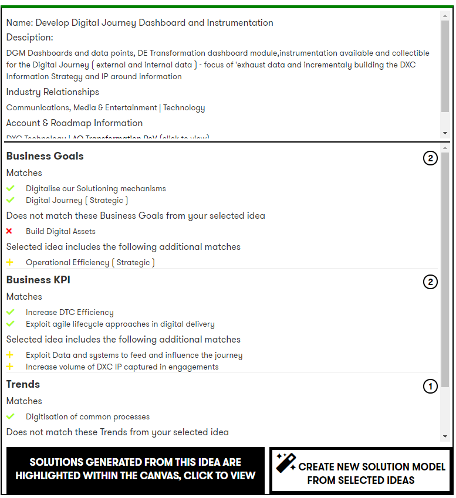
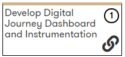
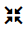
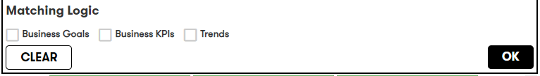
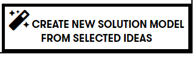
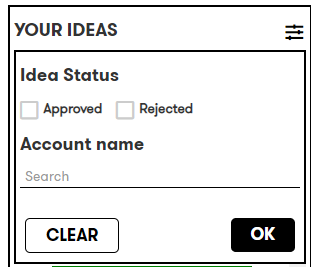
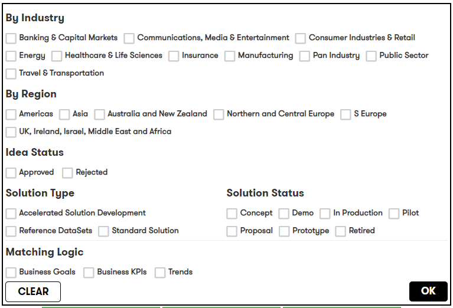

# Digital Explorer | Roadmap - Idea Analyzer

Introduced : September 2019

The Idea Anaylzer allows users to compare their **Roadmap ideas** against other ideas within the platform.   From the analyst the user can take a number of actions 

1. Create a new solution model for their selected idea
2. Create a new solution model based on a combination of their idea and a selected matching idea
3. Copy an existing solution 

## Accessing the Idea Analyzer
- You can load the Idea Analyzer from the **homepage** of the **Digital Explorer Roadmaps** module

## Idea Analyzer layout

The idea analyzer is split into 3 sections
 
 

### Your Ideas - List all the ideas defined within your roadmaps
### Matches - Lists the matching ideas and solutions for a selected idea
### Information Panel - Provides detailed information for any selected idea (your idea or matches)

## Reviewing Matches

1. To begin the matching process select any idea within your ideas list 
 
 
1. Matching ideas and solutions are presented in the middle panel 
 
:bulb: the number within each card reflects the number of matching items between your idea and the matched idea.  
1. Upon selecting a matched item, the detailed information is shown within the Information Panel 
 

### Matching Logic
Each item is matched against 3 data points 

1. Business Goals
2. Business KPIs
3. Trends (Business and Technology)

The detailed view of a selected item will give you a breakdown of the matches made, plus:
1. Elements not matched from your selected item
2. Additional elements which are not included within your source idea

:bulb:  If the matched ideas has a Solution model associated to it, this is highlighted with the `link` icon within the solution card. 
 
:bulb: This is also called out at the bottom of the information panel 
:bulb: You can quickly show the associated solutions by selecting the `collapse` icon from the top section of the matching panel 
  

#### Matching Logic Weighting 
You have the option to change the weighting of the matching logic via the filters within the matching panel 
  
- Balanced : equal matching weights for all areas
- Goals : x2 matching value for business goals
- KPI's : x2 matching value for business KPIs
- Trends : x2 matching value for trends
 

### Available Actions
#### Create new solution model
For a single idea or your idea plus a selected idea you can generate a new solution model.  
 
The generated model includes the following details from your source idea
1. Idea Name
2. Idea Description
3. Business Goals
4. Business KPI's
5. Trends 
 
The generated model includes the following details from the matched idea (if selected)
1. Business Goals
1. Business KPI's
1. Trends 
   

#### Copy an existing solution
If an existing solution is a close match to your requirements, you can select to copy the solution and start to develop your own extended viewpoint against your idea. 
 

- The copied solution will transfer all the information from the source solution into a new solution
- The new solution model will have a relationship back to your source idea
- The new solution model will create a relationship to the source solution

## Filters
### Your Ideas
Within the `Your Ideas` panel you can filter against the following areas
 
 
1.  Idea Status
2.  Account Name

### Matches
Within the matching panel you can filter against the following areas
 
 

