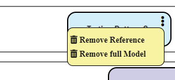

# Solution Composition

As each solution captured within Digital Explorer is a fully realized data representation and model; it's possible to merge or combine one or more models into a new solutions - **Solution Composition and Modelling** allows users to select one or more existing solutions and create new models

### Solution Model 

Instead of adding just a single _Feature_ to a solution model. the **Model** tab allows users to add the following into their solution models.

- Feature : A single feature
- DXC Offering : A single feature representing a DXC offering
- Partner Solution : A full solution model describing a DXC partners capabilities 
- Pattern : A solution pattern or use case from an existing solution model - [see pattern modelling](../Patterns/readme.md)
- Add new feature : a single new feature

---

#### Preview Window
Before you add an existing model into your solution you have the option to preview the included motivations and features

 

#### Embedded Models
Any other models added to your solution are shown in the _Embedded Model_ section of the solution canvas

 

#### Model Actions

 

- Remove full model - removes all the motivations and features included with the model
- Remove model reference - removes just the reference to the embedded model, doesn't remove 

#### Motivation Actions

 

- Remove - Removes the motivation from the current model

#### Feature Actions

 

- Edit : Edit
- More information : Show detailed information about the feature and it's usage in other solutions
- Remove - Removes the feature from the current model

##### Edit Feature

 

### Solution Data Sheet

#### Model View

 

Graphical representation of your solution, hover over each embedded model to highlight the associated motivations and features.

### Origin and Usage

Detailed view of all the usage patterns for the solution - embedded models or patterns, copies and the usage within other solutions.

