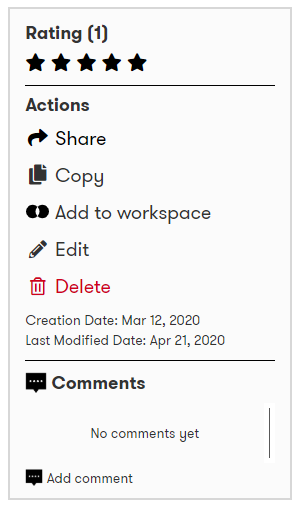
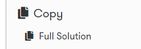
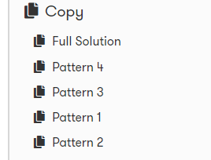
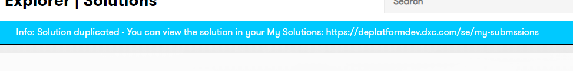
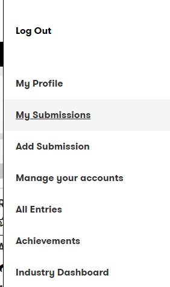
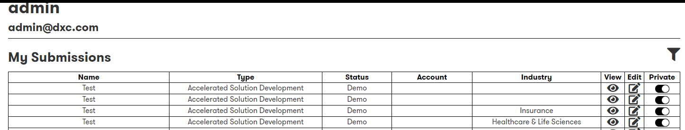

# Solution Copy

It is possible to copy an existing solution within Digital Explorer and modify the copy to suit your needs.

:bulb: You can copy either a full solution model or if the solution has [patterns](../Patterns/readme.md) defined copy an individual pattern

## Step-by-Step guide.

1. Access the DigitalExplorer site
     - https://digitalexplorer.dxc.com/se
      
1. If not already in the `Solutions` module change to the solutions module via the `appblock` in the header
     
1. Select **`Sign In`** from the header and login with your global pass account
     
1. Search/View the solution you wish to copy
1. Expand `Copy` from the side
     
1. Select `Full Solution` 
     
1. :bulb: If the solution has Patterns you select an individual pattern
     
1. Once the solution is copied a notification is shown in the breadcrumb section
  
1. To view/edit your copied solution or pattern select `My Submissions` from the menu
      
      
