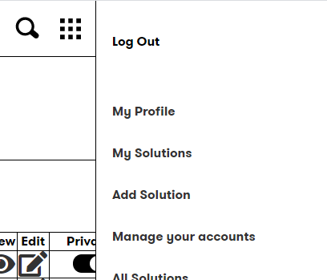
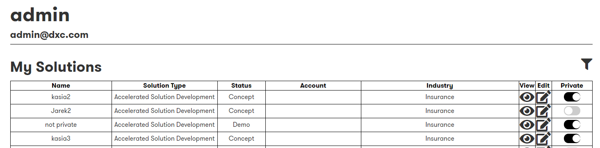
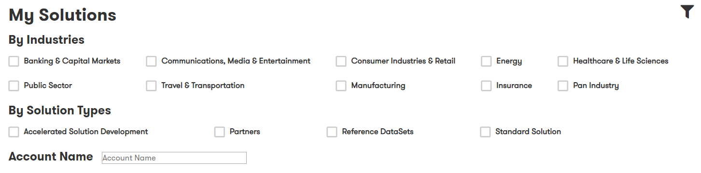
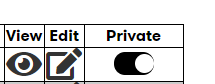

## Digital Explorer : Managing Solutions

Via the "My Solutions" page solution contacts have the option to 

- view
- edit
- toggle the "is Private" value for their solutions

Solution contacts can also filter their solution list based on 

- Industry
- Solution Type
- Account name

### Walkthrough

1. Access the DigitalExplorer site
     - https://digitalexplorer.dxc.com/se
      
1. If not already in the `Solutions` module change to the solutions module via the `appblock` in the header
     
1. Select **`Sign In`** from the header and login with your global pass account
     
1. Select **`My Solutions`** from the menu
      
       
1. Select the Filter icon to show the available filters 
  
 
1. To view a solution select the edit icon
1. To edit a solution select the edit icon
2. To change the IsPrivate value click on the toggle switch