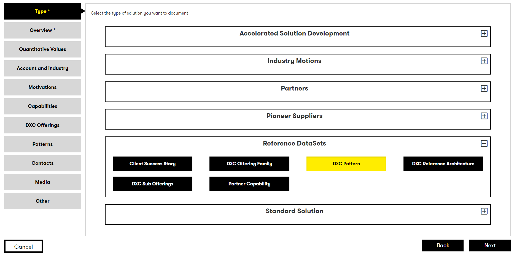
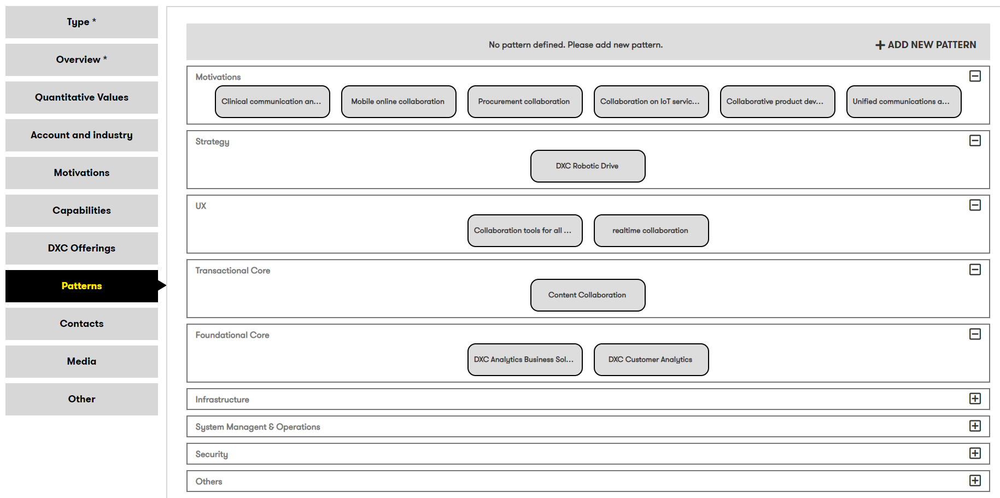
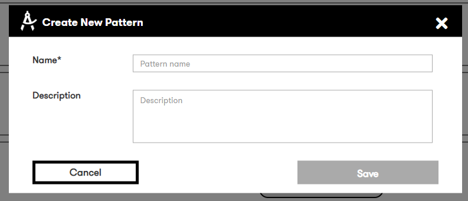
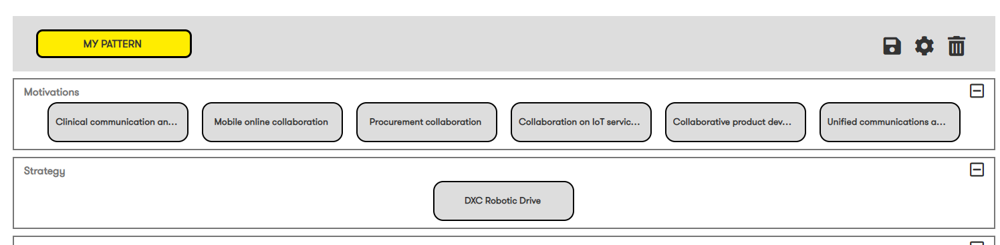

# Solution Patterns

## Standard Patterns

It's possible to create a single solution model as a Pattern within Digital Explorer; leveraging the full inimageation model and integrating the pattern into the wider inimageation eco-system the platimage enables.
A dedicated solution (sub)type for pattern is available today.

 

### To add a standalone pattern 

1. Access the DigitalExplorer site
     - https://digitalexplorer.dxc.com/se
      
1. If not already in the `Solutions` module change to the solutions module via the `appblock` in the header
     
1. Select **`Sign In`** from the header and login with your global pass account
     
1. Select **`Add Entry`** from the menu
     
     
1. **The Solution image**
    - The first page gives an overview of how to approach the solution submission.  The key here is to consider the piece parts within your solution.
     
        - Select **`Next`** to enter the solution image
1. Select the `DXC Pattern` within the Reference Datasets
     
1. Follow the standard solution entry walkthrough [LINK](../SubmittingSolutions/readme.md)

## Embedded Patterns

Digital Explorer also provides the ability to document 1 or more patterns within a single larger solution model (e.g. a Reference Architecture)

 

A new step is available within the solution submission process `Patterns`, within this section you have the option to create one or more embedded patterns within a given solution model.

 

### Creating a new embedded pattern

1. Select `ADD NEW PATTERN`
  
1. Enter the required `name` and `description`
  
1. Once the pattern has been defined it will be selected and you can now select the motivations and features which should be included
  
  
1. Select the `Save` icon in the banner section to confirm the selections
  

### Editing an existing embedded pattern

1. Change the name or description
    1. Select the required pattern from the banner
    2. Select the `gear` icon

2. Changing the selected motivations or features. 
To edit an existing embedded pattern, simply select the pattern from the banner and make the required changes; clicking the `save` icon once complete

### deleting an embedded pattern
To delete an existing embedded pattern, simply select the delete/trashcan icon in the banner and confirm.
  

