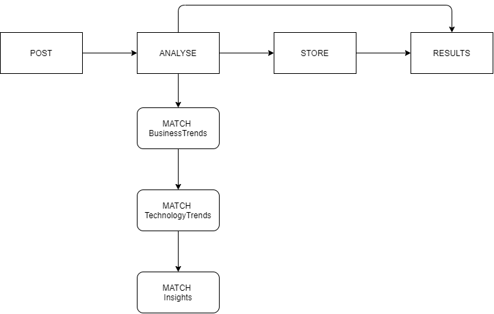
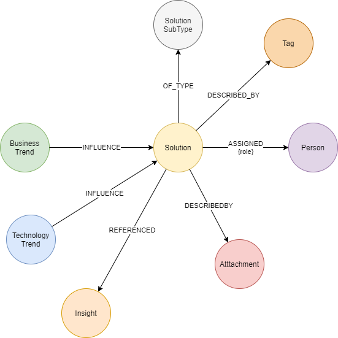
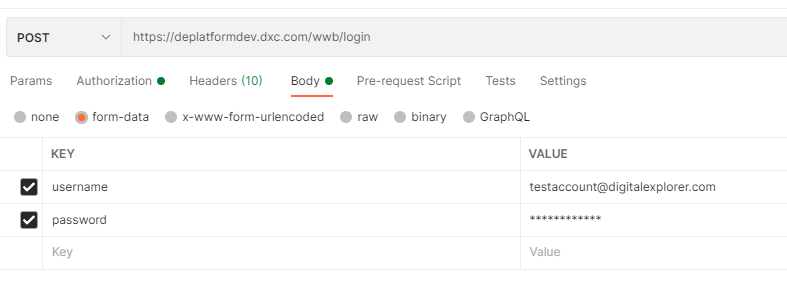
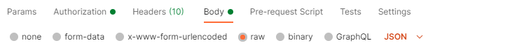

# Solution add API - simple model

Adding a solution to the Graph database will create a base entry within the Graph, **the API will also review and create relationships to known business and technology trends as well as to insights stored from the NLP engine.**

 

## Created Graph Model

 

## Post a new solution

### Create a new `POST` request

### Authorization

Currently the API requires an active session with the backend services of Digital Explorer, bearer tokens are not yet supported.

- Request an application account from the Digital Explorer team

## POSTMAN WALKTHROUGH

### Step 1 : Create an active session with the login API

API: `https://digitalexplorer.dxc.com/wwb/login`

#### Method : POST

##### Body structure

- form-data
- Key : username
- Key : password

 

A successful connection will simply return `1` in the response

### Step 2 : Add your solution information via the Simple Solution API

API : `https://digitalexplorer.dxc.com/wwb/api/simpleSolution`

#### Method : POST

### Body

- Set the body format to `raw` and structure `JSON` 
 
- Use the following body text structure

~~~
{"id":null,
"name":"Solution name",
"description":"",
"elevatorPitch":"",
"solutionSubType":12600,
"referenceable":"No",
"status":"Concept",
"contacts":[{"name":"Test","email":"test@email.com","role":"Solution Owner"}],
"attachments":[],
"isPrivate": false,
"metaSubIndustries":[],
"tags":[]}
~~~

### Name
- Free text

### Description
- Free text

### Elevator Pitch
- Free text

### SolutionSubType
- Solution Sub Type ID
- How to find your solution sub id NEEDS A USER GUIDE

### Referenceable

- Yes/No
- **Default is No**

### Status
- Solution Status
- Current solution status values - NEEDS A USER GUIDE

### Contacts
- List
- **Limitations : Current API requires a @dxc.com email address and the user must exist in the database**
- Example with multiple contacts

 ~~~
 "contacts":[
     {"name":"John Smith","email":"user1@dxc.com","role":"Solution Owner"},
    {"name":"Jane Doe","email":"user2@dxc.com","role":"Solution Architect"}
 ],
 ~~~

### Attachments
List : 
~~~
"attachments":[{"id":406725, "attachmentType":"REMOTE", "docType":"PDF","name":"Brochureuri:http://dgxcentre.com/wp-content/uploads/2017/03/DGX-Design-Studio-Workshop-Brochure.pdf"}],
~~~

### isPrivate
Private solutions are not included in the search or recommendation engine results within the main Digital Explorer platform

- boolean (true/false)
- **Default is false**

### Sub Industries
- Optional
- List
- Aligned to DXC Industry Taxonomy
- Example with multiple Sub Industries

~~~
"metaSubIndustries":[3817, 2907],
~~~

### Tags
- Optional
- List
- Example with multiple Tags
~~~
"tags":["my tag","another tag"]
~~~

