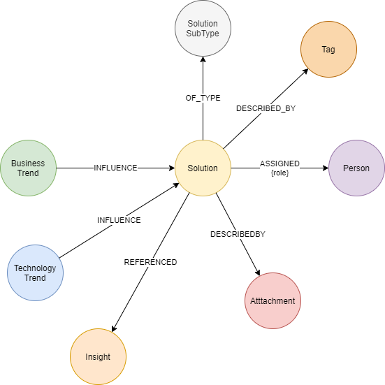
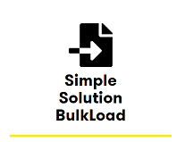
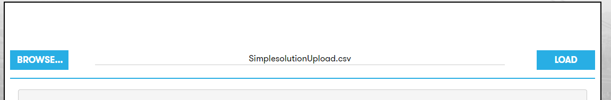
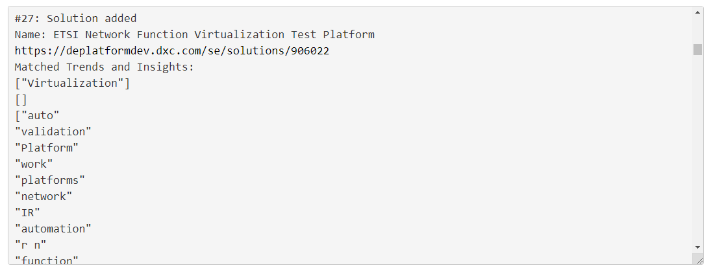
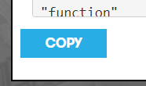

# Digital Explorer - Solutions
## Bulk Upload

The Digital Explorer solution module allows for solution editors and administrators to upload multiple solutions via a bulk load form.  The bulk load form requires only a simple representation of a solution to be included. 

### [SAMPLE FILE](sample.csv)

 
The following information is required

- Solution Name
- Description
- Elevator Pitch	
- Solution SubType	
- Referenceable	**OPTIONAL - DEFAULTS TO NO**
- Status	
- Contacts	
- Attachments **OPTIONAL**
- IsPrivate **OPTIONAL - DEFAULTS TO FALSE**
- MetaSubIndustries	 **OPTIONAL**
- Tags **OPTIONAL**

### The following fields support a list of entries

- contacts
- attachment
- MetaSubIndustries
- tag
 
### Structure of listed entries

- A list within the CSV file begins and end with the square brackets `[ ]`
- Values within the list are separated by a semi colon `;`

### Examples

### Contacts

The contact information needs to be provided in the following structure

- `Name, email, role`

`[admin;admin@dxc.com;Solution Owner;test;test@dxc.com;Architect]`

### attachments

`[https://www.dxc.com;https://luxoft.com]`

### MetaSubIndustries

`[405040;843]`

### tags

`[tag1;tag2;tag3]`

---

## Upload process

The upload process reviews the following fields and creates relationships to any matching Business Trends, Technology Trends or Insights within the knowledge graph, this ensures the added solution is connected to the recommendation engine used within the Digital Explorer Workspace and Roadmap modules, as well allowing similarity queries to be run against any of the created solution entries.

- Solution Name
- Description
- Elevator Pitch	

### Data Model

The following Graph model is created for a solution uploaded via the simple solution API/CSV loader

 

---

## Special considerations

The `solution Sub type` and `sub industries` require the internal Digital Explorer ID to be provided, review the links below for the latest codes to be used.

- [Solution Types](SolutionTypes.md)
- [Industries](Industries.md)

## Updating existing entries

To update an existing entry, simply include the Digital Explorer Solution ID in the first column of the CSV file.

---

## Results within the Digital Explorer Solutions datasheet

The simple solution upload option creates a minimum solution entry within Digital Explorer,  the following tabs will have information presented:

- Overview
- Motivations: lists any matched trends
- Account and industry: lists any included 
- Media : Link back to the source location
- Contacts : Contract details for the solution

**Note: It is possible to edit the solution within Digital Explorer to take advantage of the full solution metamodel**

---

## Uploading files

To access the bulk upload UI, Administrator or Solution Editor roles need to be assigned to the user.

1. Access the solutions module
2. Select "admin" from the menu
3. Select "Simple Solution Bulk Load" 
 
1. Browse to select the required file to upload
2. Select "Load" once your file is selected 
 
6. the results window will display the outcome from each solution loaded, detailing the following
   1. Solution Name
   2. link to solution entry within Digital Explorer
   3. Any matched Business or Technology Trends or Insights are also listed 
    
7. You can copy the results to your local clipboard to paste into any external application 
 
